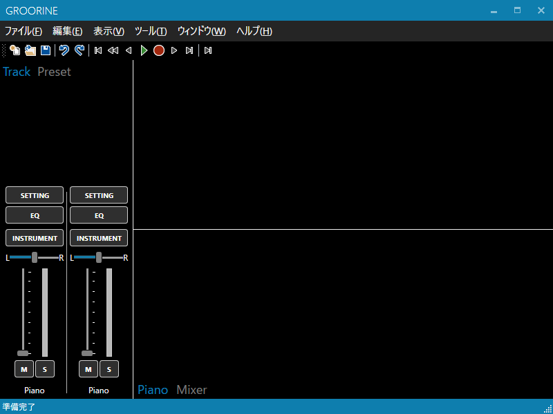

Groorine
==============

[日本語](readme-ja.md) ＊ English

 

Groorine is an open source project to develop DTM application. This is started from my project studies.

## Description

I often use "Domino" and "Logic Pro X" to compose music.

I want a music editor which has these good points. And I have wanted to create my original music editor.

## Build

1. clone this project `% git clone https://github.com/Citringo/Groorine.git`
1. Open solution file with Visual Studio 2015
1. Press `F5` to build the project

## Run
Groorine runs on Windows and ".NET Framework 4.5.2". 

You won't be able to run on wine-mono because these may not support WPF (unverified...)

I may port to osx if this project is completed.

## Contributing
Please wait full coding convention. Now you have to accept the following simple convention.

The coding convention used in this project is like [C# Coding Conventions](https://msdn.microsoft.com/library/ff926074.aspx).
But it has some exceptions:

- Keep tab character. Don't convert tab to space.

If you contribute to this project, use [Pull Request](/Citringo/Groorine/pulls).

## Issues
If you have something issue, post to [Issues](/Citringo/Groorine/issues). 

You should include the following informations in the issue:

- **Version** (ex: 0.0.1)
- **Your Environment Information** (example: Windows 10 Pro Insider Preview 14328)
	- I want you to write particularly.

## License
This project is under the MIT license. Please see [LICENSE](LICENSE)

*(C) 2016 Citringo and GitHub Contributor*
